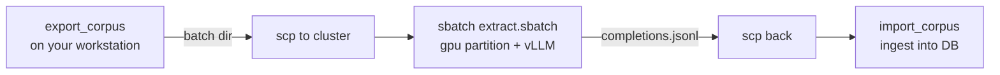

# Bulk claim extraction on NIEHS HPC (SLURM + local LLM)

Extract claims from many papers at once by running a local LLM on the NIEHS SLURM
cluster's GPU partition, then replaying the results back into InterCiter. Extraction is
**identical** to a live run — the same strict, source-grounded extractor validates the
model output; the cluster just supplies cheap, private compute.

## Why offline batch?

The extractor is model- and endpoint-agnostic (see `backend/interciter/ingestion/`).
Live extraction calls an OpenAI-compatible endpoint per passage; bulk extraction instead:

1. exports every prompt to one file locally,
2. runs them all in one GPU job on the cluster (no per-request network, no API costs),
3. replays the completions through the same validator.

A prompt's `request_id` is content-addressed over `template_version + model + passage_text`,
so responses always map back to the right prompt regardless of order.

## The three-step workflow



### 1. Export a batch (workstation)

Give it a list of PMCIDs (one per line, `#` comments allowed) and/or a directory of JATS
XML files. Papers are fetched from PMC OA and cached; each source is copied into the
batch directory so the import step needs no network.

```bash
cd backend
# PMCIDs (fetched from PMC OA):
uv run interciter llm-export-corpus --pmcids pmcids.txt --out-dir ../batch-01 \
    --model Qwen/Qwen3.6-35B-A3B
# ...or a directory of JATS files you already have:
uv run interciter llm-export-corpus --jats-dir ./xml --out-dir ../batch-01
```

This writes:

```
batch-01/
  manifest.json          # model + template + per-doc request-ids
  prompts.jsonl          # the runner's input (OpenAI chat shape)
  sources/<doc>.xml      # each paper, for offline import
```

The `--model` string is recorded in the manifest and is what the runner loads on the
cluster; make it a real HuggingFace id (or a path the cluster can see).

### 2. Run on the cluster (SLURM GPU job)

Copy the batch up (via the NIEHS gateway / scigate), set up vLLM once, then submit.

```bash
scp -r batch-01 scigate:~/interciter/           # or through ssh.niehs.nih.gov

ssh scigate
cd ~/interciter
# One-time: create the vLLM venv (nodes have internet; weights download on first run).
bash /path/to/InterCiter/scripts/hpc/setup_env.sh

# Submit. Smoke test: one A100 + a model that fits in bf16.
sbatch --gres=gpu:a100:1 --mail-user=you@nih.gov \
    --export=ALL,MODEL=google/gemma-4-12b-it,BATCH_DIR=$PWD/batch-01 \
    /path/to/InterCiter/scripts/hpc/extract.sbatch
```

Monitor with `squeue -u $USER`, `sacct`, or the `interciter-extract-<jobid>.out` log.
The job writes `batch-01/completions.jsonl`.

**Multi-GPU models** (e.g. Qwen3.6 27B or 35B-A3B): request more GPUs and shard the
model — `--gres=gpu:a100:2` with `TENSOR_PARALLEL_SIZE=2` in the `--export` list. The
sbatch script defaults `TENSOR_PARALLEL_SIZE` to `$SLURM_GPUS_ON_NODE`.

### 3. Import the results (workstation)

```bash
scp -r scigate:~/interciter/batch-01/completions.jsonl ./batch-01/
cd backend
uv run interciter llm-import-corpus --dir ../batch-01 --responses ../batch-01/completions.jsonl
```

Every doc in the manifest is ingested with its replayed answers. Missing responses simply
abstain, so a partial run still ingests what completed.

## Files here

| File | Purpose |
| --- | --- |
| `run_vllm_batch.py` | Standalone vLLM runner (prompts.jsonl → completions.jsonl). Only needs `vllm`; no InterCiter install on the cluster. |
| `extract.sbatch` | SLURM job that activates the env and runs the runner on the gpu partition. |
| `setup_env.sh` | One-time creation of the vLLM venv on the cluster. |

## Choosing a model / GPU sizing

The NIEHS `gpu` partition (confirmed 2026-07) offers **A100-PCIE-40GB** (4 or 2 per node,
compute 8.0, bf16-capable — prefer these) and **V100** (16–32 GB, fp16 only). Access is via
account `niehs_dttothers`, QOS `normal`. Re-check live with `sinfo -p gpu -N -o "%N %t %G"`.

Current top open-weight small/medium models (Artificial Analysis, 2026) sized against
A100-40GB (bf16 ≈ 2 GB per 1B params, +~15% for KV cache):

| Model | Intelligence | Size | Fits on | vLLM flags |
| --- | --- | --- | --- | --- |
| Qwen3.6 27B | 37 | 27B dense | 2× A100 (TP=2), or AWQ on 1× | `--tensor-parallel-size 2` |
| **Qwen3.6 35B A3B** | 32 | 35B MoE / **3B active** | 2× A100 (TP=2) | `--tensor-parallel-size 2` — fastest for bulk |
| Gemma 4 31B | 29 | 31B dense | 2× A100, or AWQ on 1× | `--tensor-parallel-size 2` |
| Gemma 4 26B A4B | 26 | 26B MoE / 4B active | AWQ on 1×, or 2× | `--quantization awq` |
| **Gemma 4 12B** | 22 | 12B dense | **1× A100-40GB** | (defaults) — simplest |
| **Qwen3.5 9B** | 21 | 9B dense | **1× A100-40GB** | (defaults) — simplest |

Recommendation for this **structured-JSON, biomedical, bulk** task (throughput +
instruction-following matter more than frontier reasoning):

- **Bulk production:** **Qwen3.6 35B A3B** on `--gres=gpu:a100:2` — MoE with only 3B active
  gives near-27B quality at much higher tokens/sec.
- **Highest quality:** **Qwen3.6 27B** (TP=2) if you accept slower dense inference.
- **Smoke test:** **Gemma 4 12B** or **Qwen3.5 9B** on a single A100 — validate the pipeline
  before scaling.

**Thinking off:** these are reasoning models, but claim extraction wants fast, deterministic
JSON — the runner defaults reasoning **off** (`chat_template_kwargs={"enable_thinking": false}`).
Pass `--enable-thinking` / `ENABLE_THINKING=1` only if you want the trace. Confirm the exact
HuggingFace repo id for your model before submitting. For quantized weights add the matching
`--quantization` flag in `run_vllm_batch.py`; `--json` (or `GUIDED_JSON=1`) constrains output
with guided decoding if your vLLM build supports it (the extractor rejects malformed output
regardless).

## Notes

- **Auth:** login is smart-card (PIV/CAC) to a SOCKS5 gateway (`ssh.niehs.nih.gov`), then
  a password hop to `scigate`. Automated login is not possible; establish sessions yourself.
- **SLURM PATH:** `sinfo`/`sbatch`/`squeue`/`scontrol` live under `/ddn/gs1/tools/slurm/bin`
  and are only on `$PATH` in a **login** shell. Non-interactive `ssh scigate '…'` needs
  `bash -lc "…"` (or a full path) to see them.
- **Model cache:** `HF_HOME` defaults to `$HOME/.cache/huggingface` (persistent, on shared
  `/ddn`), so model weights download **once** and are reused by every job — never per-batch.
  Point it elsewhere with `--export=ALL,HF_HOME=/path,…` if you prefer scratch.
- **Compute placement:** never run workloads on `scigate` (the gateway) — submit to SLURM
  (`sbatch`/`srun`) or use the `fermi`/`triton` compute servers. Even env setup (`setup_env.sh`)
  should run on a compute node, e.g. `srun --partition=norm --cpus-per-task=4 --mem=16g --pty bash`.
- **GRES:** `--gres=gpu:a100:1` (type-qualified) and `--gres=gpu:1` both work on the gpu
  partition; scale the count for tensor-parallel multi-GPU jobs.
- **Reproducibility:** the manifest pins the model + prompt-template version; the import
  step reconstructs the extractor with exactly those so `request_id`s line up.
